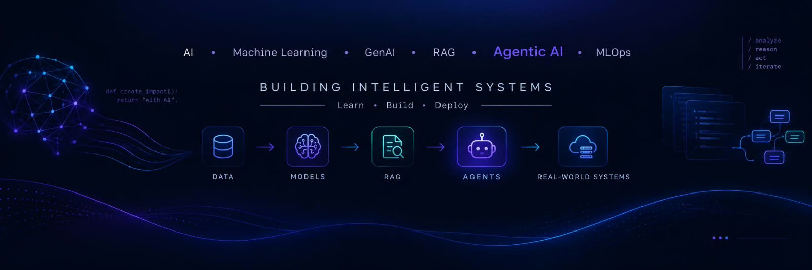

# ✦ D I S H A ✦

### Data Scientist · Machine Learning Engineer

**Building with Agentic AI & scaling real-world solutions.**

 

  

---

## ✦ Hi, I'm Disha 

I'm a **Computer Science undergraduate** passionate about **Data Science, Machine Learning and AI**.

I learn by building — working with data, understanding problems, experimenting with ML models, and turning ideas into practical applications.

Currently, I'm exploring **LLMs, RAG, Agentic AI and MLOps**, with a focus on building AI systems that can move beyond experimentation into real-world applications.

> **Curious about data.**
> **Serious about building.**
> **Always learning.**

---

## 🛠️ Tech Stack

### 💻 Languages

### 🤖 AI / ML

### 🗄️ Databases & Vector Search

### 📊 Data & Frameworks

### ⚙️ Tools & Platforms

**CURRENTLY EXPLORING**

`LLMs` → `RAG` → `Agentic AI` → `MLOps`

---

# ✦ Featured Project

## 🛡️ Trustify

### AI-Powered Spam Email Detector

 

| 🎯 Test Accuracy | 🚨 Spam Recall |
| :--------------: | :------------: |
|    **98.36%**    |   **99.05%**   |

 

An NLP-based ML application that classifies emails as **Spam or Ham** using TF-IDF vectorization and Random Forest.

 

 

---

# ✦ Achievements

### 🏆 Highlights

# ✦ Currently Learning

→

→

→

**From ML models → intelligent systems → deployable AI solutions.**

---

# ✦ Let's Connect

  

  

  

  

### ✦ Learn by building. Build with purpose. ✦

